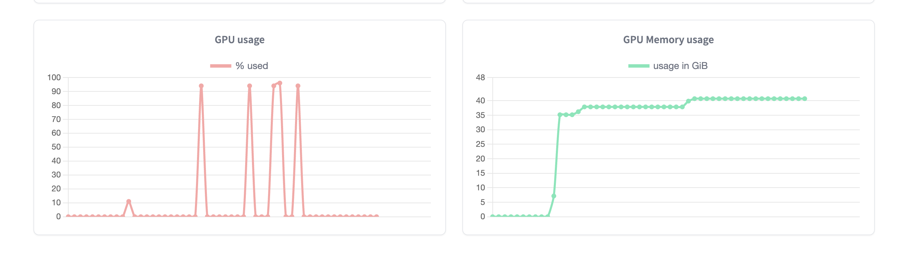
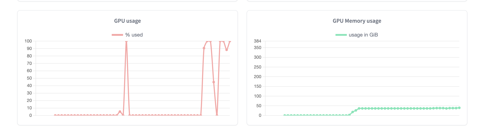

# Midscene Playwright Uitars Example

## Introduction
This is a Proof of Concept for AI-powered automated E2E testing, by using [Midscene](https://github.com/web-infra-dev/midscene) with [UI-Tars LLM](https://github.com/bytedance/UI-TARS), on top of Playwright.

The demo are created with following base tools:

| Tools      | Versions                                 |
|------------|------------------------------------------|
| Playwright | 1.50.1                                   |
| Midscene   | 0.12.0 (customised branch with some fix) |
| UI-Tars    | 7B-sft                                   |


## Important
- To run the test showed in the demo, it requires to have my own branch in Midscene https://github.com/web-infra-dev/midscene/pull/412 

- You must either deploy UI Tars in Hugging Face, or other approaches to have this model. 

- It's not ready for production usage yet.

## GPU Usages 
When I execute the same test, here are the GPU usages for `UI-Tars:7B` and `UI-Tars:72B`


(GPU Usage for UI-Tars:7B, with LS40s, 1 x GPU, 48GB GPU memory, 7 x vCPU, 30GB memory )


(GPU Usage for UI-Tars:72B, with LS40s, 8 x GPU, 384GB GPU memory, 190 x vCPU, 1532GB memory )

## Quick start
```bash
yarn

cp .env.example .env #then fill up the variables

# Workaround - due to UI-Tars doesn't support response_format via OpenAI
yarn add ~/cf/midscene/packages/midscene # change it to the path where you clone the source code of midscene
```

## Documents

https://bytedance.sg.larkoffice.com/docx/TCcudYwyIox5vyxiSDLlgIsTgWf


## References

> @software{Midscene.js,  
>   author = {Zhou, Xiao and Yu, Tao},  
>   title = {Midscene.js: Let AI be your browser operator.},  
>   year = {2025},  
>   publisher = {GitHub},  
>   url = {https://github.com/web-infra-dev/midscene}  
> }


> @article{qin2025ui,
>   title={UI-TARS: Pioneering Automated GUI Interaction with Native Agents},
>   author={Qin, Yujia and Ye, Yining and Fang, Junjie and Wang, Haoming and Liang, Shihao and Tian, Shizuo and Zhang, Junda and Li, Jiahao and Li,  Yunxin and Huang, Shijue and others},
>   journal={arXiv preprint arXiv:2501.12326},
> }